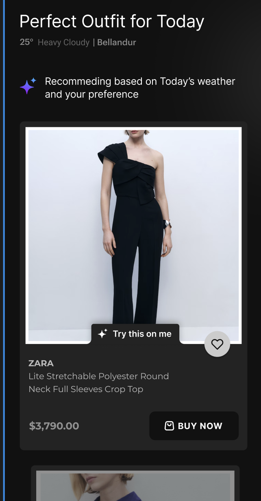
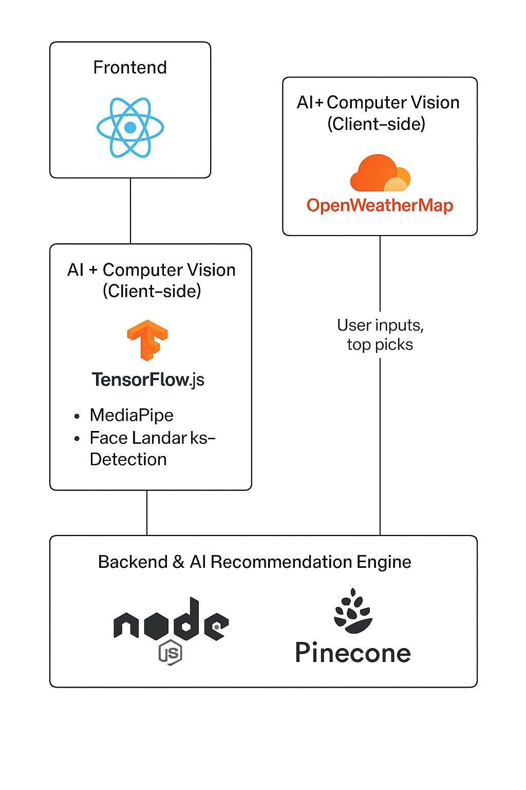

# 🧠 AI Stylist

AI Stylist is a smart, fashion-forward AI assistant that helps users find clothing and styles that match their preferences and physical features. Built with modern web technologies and AI models, this tool bridges personal style with machine intelligence.

Whether you're a fashion tech startup, an indie developer, or just a curious user—AI Stylist can help you explore how AI can personalize fashion experiences at scale.

# ✨ Features

Face & Skin Tone Analysis: Uses MediaPipe FaceMesh and TensorFlow.js to detect skin tone, face shape, and age range.

Live Webcam Detection: Real-time user analysis through your webcam.

Fashion Style Recommendation: Suggests clothing styles and color palettes that suit your facial features.

AI Avatar Preview: Visualize your personalized style on an AI-generated avatar.

Responsive UI: Built with React and Tailwind CSS for seamless cross-device performance.

# 📸 Use Case

This tool is ideal for:

Fashion e-commerce platforms

Personal styling assistants

Virtual try-on experiences

Makeup and skincare advisors

Custom clothing or jewelry fit suggestions

📬 Contact
Have a question or idea? Reach out via issues or connect with https://www.linkedin.com/in/balajeed/

# Design




# Frontend

- React + Tailwind → UI, styling
- TensorFlow.js & MediaPipe → Facial landmark detection
- API requests to backend

# Backend

- Node.js → Logic, routing
- Pinecone Assistant → Vector search for outfit - embeddings (Moved to Vector DB but some
  more time is required)
- OpenWeatherMap API → Real-time weather

# Flow



Weather Input → User Form/Preferences → Camera scan → Style + skin tone detection
→ Backend request → Pinecone fetch + trend mapping → Outfit recs → UI renders
suggestions

# FrontEnd Configuration: React + TypeScript + Vite

This template provides a minimal setup to get React working in Vite with HMR and some ESLint rules.

Currently, two official plugins are available:

- [@vitejs/plugin-react](https://github.com/vitejs/vite-plugin-react/blob/main/packages/plugin-react/README.md) uses [Babel](https://babeljs.io/) for Fast Refresh
- [@vitejs/plugin-react-swc](https://github.com/vitejs/vite-plugin-react-swc) uses [SWC](https://swc.rs/) for Fast Refresh

## Expanding the ESLint configuration

If you are developing a production application, we recommend updating the configuration to enable type-aware lint rules:

```js
export default tseslint.config({
  extends: [
    // Remove ...tseslint.configs.recommended and replace with this
    ...tseslint.configs.recommendedTypeChecked,
    // Alternatively, use this for stricter rules
    ...tseslint.configs.strictTypeChecked,
    // Optionally, add this for stylistic rules
    ...tseslint.configs.stylisticTypeChecked,
  ],
  languageOptions: {
    // other options...
    parserOptions: {
      project: ["./tsconfig.node.json", "./tsconfig.app.json"],
      tsconfigRootDir: import.meta.dirname,
    },
  },
});
```

You can also install [eslint-plugin-react-x](https://github.com/Rel1cx/eslint-react/tree/main/packages/plugins/eslint-plugin-react-x) and [eslint-plugin-react-dom](https://github.com/Rel1cx/eslint-react/tree/main/packages/plugins/eslint-plugin-react-dom) for React-specific lint rules:

```js
// eslint.config.js
import reactX from "eslint-plugin-react-x";
import reactDom from "eslint-plugin-react-dom";

export default tseslint.config({
  plugins: {
    // Add the react-x and react-dom plugins
    "react-x": reactX,
    "react-dom": reactDom,
  },
  rules: {
    // other rules...
    // Enable its recommended typescript rules
    ...reactX.configs["recommended-typescript"].rules,
    ...reactDom.configs.recommended.rules,
  },
});
```
